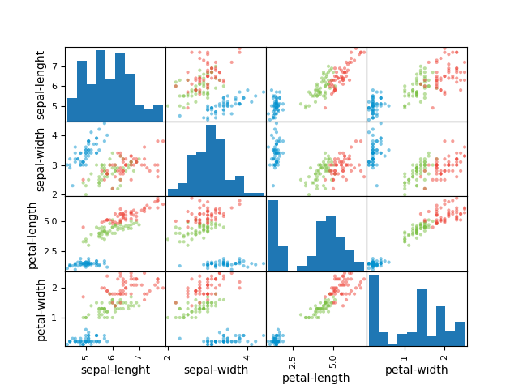

# Iris Flowers Dataset Classification

This repository hosts the code, tests, documentation and pipelined model for the analysis undertaken of the iris flowers dataset.

## About the Dataset: Iris Flowers

The repository is hosted at [UCI Machine Learning Repository](https://archive.ics.uci.edu/ml/machine-learning-databases/iris/)

The data set is multivariate and contains ratio(numerical) and nominal data.
There are 150 instances and 4 attributes.

## Project Steps

1. [x] Data Download
2. [x] Data Loading
3. [x] Data Summarization
4. [x] Data Visualization
5. [x] Partitioning of dataset into Training dataset and Validation dataset
6. [x] Model Creation
7. [x] Model Selection
   - [x] Create test harness using K-Fold Cross Validation, with scoring set to 'accuracy'
   - [x] Evaluation of models using test harness
   - [x] Summarization, Visualization and Comparison of Results
   - [x] Model Selection
8. [x] Making Predictions using Selected Model
9. [x] Summarization of Results
10. [x] Saving the Pipelined Project
11. [x] Testing the saved model

## Project Files

1. Dataset
2. Python file (using template.py as the base)
3. Model files
4. Image files
5. Documentation
   1. README.md
   2. Project Report
   3. Slide deck

## Images

### Results

### Tests

The following things were tested:

- Loading and partiioning of data
- Accuracy of finalized model

### Figures

#### Box and Whisker Plot

#### Histogram Plot

#### Scatter Matrix

#### Cross Evaluation Results Box Plot

## Project Output

    Shape of the dataset(instance,attribute):
    (150, 5)
    We can see that there are 150 instances(or rows) and 5 attributes
    First 20 instances:
        sepal-lenght  sepal-width  petal-length  petal-width        class
    0            5.1          3.5           1.4          0.2  Iris-setosa
    1            4.9          3.0           1.4          0.2  Iris-setosa
    2            4.7          3.2           1.3          0.2  Iris-setosa
    3            4.6          3.1           1.5          0.2  Iris-setosa
    4            5.0          3.6           1.4          0.2  Iris-setosa
    5            5.4          3.9           1.7          0.4  Iris-setosa
    6            4.6          3.4           1.4          0.3  Iris-setosa
    7            5.0          3.4           1.5          0.2  Iris-setosa
    8            4.4          2.9           1.4          0.2  Iris-setosa
    9            4.9          3.1           1.5          0.1  Iris-setosa
    10           5.4          3.7           1.5          0.2  Iris-setosa
    11           4.8          3.4           1.6          0.2  Iris-setosa
    12           4.8          3.0           1.4          0.1  Iris-setosa
    13           4.3          3.0           1.1          0.1  Iris-setosa
    14           5.8          4.0           1.2          0.2  Iris-setosa
    15           5.7          4.4           1.5          0.4  Iris-setosa
    16           5.4          3.9           1.3          0.4  Iris-setosa
    17           5.1          3.5           1.4          0.3  Iris-setosa
    18           5.7          3.8           1.7          0.3  Iris-setosa
    19           5.1          3.8           1.5          0.3  Iris-setosa
    A look at the first 20 rows shows us that The data X values are of ratio(float) type and the y values are categorical and nominal
    Statistical summary:
        sepal-lenght  sepal-width  petal-length  petal-width
    count    150.000000   150.000000    150.000000   150.000000
    mean       5.843333     3.054000      3.758667     1.198667
    std        0.828066     0.433594      1.764420     0.763161
    min        4.300000     2.000000      1.000000     0.100000
    25%        5.100000     2.800000      1.600000     0.300000
    50%        5.800000     3.000000      4.350000     1.300000
    75%        6.400000     3.300000      5.100000     1.800000
    max        7.900000     4.400000      6.900000     2.500000
    From the summary we can see that the data is of 150 count. The values lie between 0 and 8.
    Class Distribution:
    class
    Iris-setosa        50
    Iris-versicolor    50
    Iris-virginica     50
    dtype: int64
    We can see that the class distributions are well balanced, with each of the 3 classes comprising a neat third of the dataset.
    Data Visualiztion & analysis
    Box and whisker

    Sepal length
    We can see a well balanced dataset. There is no visible skew. The max data point seems to be well above the 75% quartile.
    Sepal width
    We can see some outliers here, above the max point. There is slight skew towards the 75% quartile and, the data is probably skewed to the right.
    Petal length
    No outliers, but the data is very much skewed towards the 25% quartile. The 75% quartile is much closer to the mean than the 25% quartile. The minimum value is quite far from the mean.
    Petal width
    Again, the data is very much skewed towards the 25% quartile. The minimum value is quite far from the mean.
    Conclusion
    Petal length and width are both on the smaller side. Values in these 2 columns are skewed to the left. Very interesting.
    In contrast, sepal length and width are much more 'normal'.

    Histogram

    As expected, petal length and width are both heavily skewed to the left. You could draw a diagonal line from the left to the right across the Maximas of the petal width data.
    Sepal length and width assume a very broken, but still imaginable bell curve.
    Overall, the data seems very interesting.

    Scatter matrix

    There's a slight correlation between sepal length and sepal width for one of the classes. This is also the case for sepal length and petal length.
    Petal length and width also have a correlation for a part of the data.
    Conclusion
    The data has some slight correlation.

    The Cross Eval Scores using 10-kfold test harness is:
    lr: 0.9666666666666666 (0.04082482904638632)
    lda: 0.975 (0.03818813079129868)
    knn: 0.9833333333333332 (0.03333333333333335)
    cart: 0.975 (0.03818813079129868)
    nb: 0.975 (0.053359368645273735)
    svm: 0.9916666666666666 (0.025000000000000012)

    From the figure we can see the nearly all the non-linear models reach near 1.00 accuracy.

    SVM and KNN seem to have the highest estimated accuracy scores.

    Accuracy =  0.9

    Confusion Matrix:
    [[ 7  0  0]
    [ 0 11  1]
    [ 0  2  9]]

    Classification report:
                    precision    recall  f1-score   support

        Iris-setosa       1.00      1.00      1.00         7
    Iris-versicolor       0.85      0.92      0.88        12
    Iris-virginica       0.90      0.82      0.86        11

        accuracy                           0.90        30
        macro avg       0.92      0.91      0.91        30
    weighted avg       0.90      0.90      0.90        30

    ======Results for entire datset======

    Accuracy =  0.9666666666666667

    Confusion Matrix:
    [[50  0  0]
    [ 0 47  3]
    [ 0  2 48]]

    Classification report:
                    precision    recall  f1-score   support

        Iris-setosa       1.00      1.00      1.00        50
    Iris-versicolor       0.96      0.94      0.95        50
    Iris-virginica       0.94      0.96      0.95        50

        accuracy                           0.97       150
        macro avg       0.97      0.97      0.97       150
    weighted avg       0.97      0.97      0.97       150

    Model is accurate

## Future Steps

Looking at how others have approached this project and writing a report on it

## Project Status

Project is finished.
