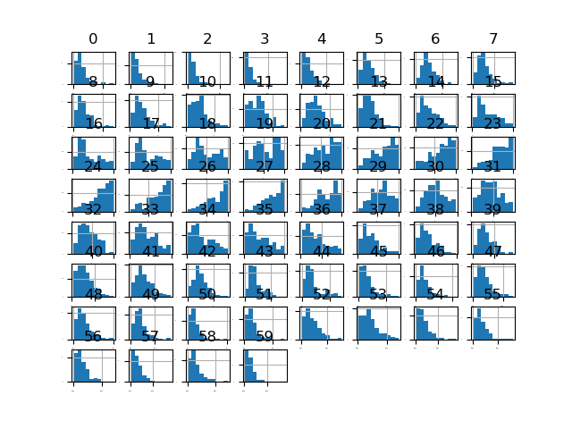
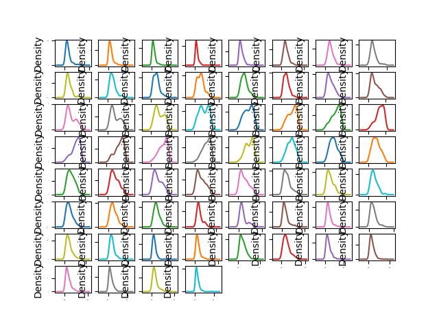
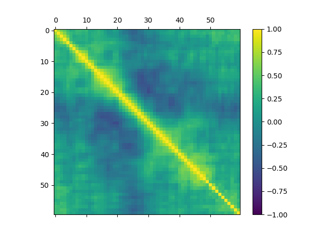

# Boston Housing Dataset Classification

This repository hosts the code, tests, documentation and pipelined model for the analysis undertaken of the Boston House Price dataset.

## About the Dataset: Boston Housing

The repository is hosted at [UCI Machine Learning Repository](https://archive.ics.uci.edu/ml/machine-learning-databases/housing/)

The data set is multivariate and contains ratio(numerical) and nominal data.
There are 506 instances and 14 attributes.

## Project Steps

1. [x] Data Download
2. [x] Data Loading
3. [x] Data Analysis
   1. [x] Descriptive Statistics
   2. [x] Data Visualization
      1. [x] Unimodal Data Visualizations
      2. [x] Multimodal Data Visualizations
4. [x] Partitioning of dataset into Training dataset and Validation dataset
5. [x] Model Creation
6. [x] Model Selection
   - [x] Create test harness using K-Fold Cross Validation, with scoring set to 'Negative Mean Squared Error'
   - [x] Evaluation of models using test harness
   - [x] Summarization, Visualization and Comparison of Results
   - [x] Standardization of Dataset
   - [x] Re-evaluation of models using test harness
   - [x] Summarization, Visualization and Comparison of Results
   - [x] Model Selection
   - [x] Model tuning
   - [x] Creation of Ensembles
   - [x] Evaluation of models using test harness
   - [x] Summarization, Visualization and Comparison of Results
   - [x] Tuning of Ensemble models
7. [x] Model Finalization
   1. [x] Model Preparation
   2. [x] Validation Set transformation
   3. [x] Summarization, Visualization and Comparison of Results
   4. [x] Training the model on entire dataset
8. [x] Summarization of Results
9. [x] Saving the Pipelined Project
10. [x] Testing the saved model

## Project Files

1. Dataset
2. Python file (using template.py as the base)
3. Model files
4. Image files
5. Documentation
   1. README.md
   2. Project Report

## Images

### Visualizations

### Tests

### Figures

## Project Output

    The shape of the dataset is (506, 14). We can see that there are 506 instances or rows and 11 attributes or columns.
    The datatpes of the attributes are:
    CRIM       float64
    ZN         float64
    INDUS      float64
    CHAS         int64
    NOX        float64
    RM         float64
    AGE        float64
    DIS        float64
    RAD          int64
    TAX        float64
    PTRATIO    float64
    B          float64
    LSTAT      float64
    MEDV       float64
    dtype: object.
    Most of them are float types, with 2 integer types mixed in.
    Lets take a look at the first 20 rows of the data:
            CRIM    ZN  INDUS  CHAS   NOX    RM    AGE   DIS  RAD    TAX  PTRATIO       B  LSTAT  MEDV
    0   6.32e-03  18.0   2.31     0  0.54  6.58   65.2  4.09    1  296.0     15.3  396.90   4.98  24.0
    1   2.73e-02   0.0   7.07     0  0.47  6.42   78.9  4.97    2  242.0     17.8  396.90   9.14  21.6
    2   2.73e-02   0.0   7.07     0  0.47  7.18   61.1  4.97    2  242.0     17.8  392.83   4.03  34.7
    3   3.24e-02   0.0   2.18     0  0.46  7.00   45.8  6.06    3  222.0     18.7  394.63   2.94  33.4
    4   6.91e-02   0.0   2.18     0  0.46  7.15   54.2  6.06    3  222.0     18.7  396.90   5.33  36.2
    5   2.99e-02   0.0   2.18     0  0.46  6.43   58.7  6.06    3  222.0     18.7  394.12   5.21  28.7
    6   8.83e-02  12.5   7.87     0  0.52  6.01   66.6  5.56    5  311.0     15.2  395.60  12.43  22.9
    7   1.45e-01  12.5   7.87     0  0.52  6.17   96.1  5.95    5  311.0     15.2  396.90  19.15  27.1
    8   2.11e-01  12.5   7.87     0  0.52  5.63  100.0  6.08    5  311.0     15.2  386.63  29.93  16.5
    9   1.70e-01  12.5   7.87     0  0.52  6.00   85.9  6.59    5  311.0     15.2  386.71  17.10  18.9
    10  2.25e-01  12.5   7.87     0  0.52  6.38   94.3  6.35    5  311.0     15.2  392.52  20.45  15.0
    11  1.17e-01  12.5   7.87     0  0.52  6.01   82.9  6.23    5  311.0     15.2  396.90  13.27  18.9
    12  9.38e-02  12.5   7.87     0  0.52  5.89   39.0  5.45    5  311.0     15.2  390.50  15.71  21.7
    13  6.30e-01   0.0   8.14     0  0.54  5.95   61.8  4.71    4  307.0     21.0  396.90   8.26  20.4
    14  6.38e-01   0.0   8.14     0  0.54  6.10   84.5  4.46    4  307.0     21.0  380.02  10.26  18.2
    15  6.27e-01   0.0   8.14     0  0.54  5.83   56.5  4.50    4  307.0     21.0  395.62   8.47  19.9
    16  1.05e+00   0.0   8.14     0  0.54  5.93   29.3  4.50    4  307.0     21.0  386.85   6.58  23.1
    17  7.84e-01   0.0   8.14     0  0.54  5.99   81.7  4.26    4  307.0     21.0  386.75  14.67  17.5
    18  8.03e-01   0.0   8.14     0  0.54  5.46   36.6  3.80    4  307.0     21.0  288.99  11.69  20.2
    19  7.26e-01   0.0   8.14     0  0.54  5.73   69.5  3.80    4  307.0     21.0  390.95  11.28  18.2.
    We can see that all the data is disparate from each other, with dissimilar ranges. Some attributes are binary(0 & 1). Some have a lot of 0s in them.
    Dataset description:
            CRIM      ZN   INDUS    CHAS     NOX      RM  ...     RAD     TAX  PTRATIO       B   LSTAT    MEDV
    count  5.06e+02  506.00  506.00  506.00  506.00  506.00  ...  506.00  506.00   506.00  506.00  506.00  506.00
    mean   3.61e+00   11.36   11.14    0.07    0.55    6.28  ...    9.55  408.24    18.46  356.67   12.65   22.53
    std    8.60e+00   23.32    6.86    0.25    0.12    0.70  ...    8.71  168.54     2.16   91.29    7.14    9.20
    min    6.32e-03    0.00    0.46    0.00    0.39    3.56  ...    1.00  187.00    12.60    0.32    1.73    5.00
    25%    8.20e-02    0.00    5.19    0.00    0.45    5.89  ...    4.00  279.00    17.40  375.38    6.95   17.02
    50%    2.57e-01    0.00    9.69    0.00    0.54    6.21  ...    5.00  330.00    19.05  391.44   11.36   21.20
    75%    3.68e+00   12.50   18.10    0.00    0.62    6.62  ...   24.00  666.00    20.20  396.23   16.96   25.00
    max    8.90e+01  100.00   27.74    1.00    0.87    8.78  ...   24.00  711.00    22.00  396.90   37.97   50.00

    [8 rows x 14 columns]
    We can see that the attributes have wildly varying ranges, means and min and max values. The data needs to be brought to scale. Also, the ZN attribute might be significant.
    Correlation between the different attributes:
            CRIM    ZN  INDUS      CHAS   NOX    RM   AGE   DIS       RAD   TAX  PTRATIO     B  LSTAT  MEDV
    CRIM     1.00 -0.20   0.41 -5.59e-02  0.42 -0.22  0.35 -0.38  6.26e-01  0.58     0.29 -0.39   0.46 -0.39
    ZN      -0.20  1.00  -0.53 -4.27e-02 -0.52  0.31 -0.57  0.66 -3.12e-01 -0.31    -0.39  0.18  -0.41  0.36
    INDUS    0.41 -0.53   1.00  6.29e-02  0.76 -0.39  0.64 -0.71  5.95e-01  0.72     0.38 -0.36   0.60 -0.48
    CHAS    -0.06 -0.04   0.06  1.00e+00  0.09  0.09  0.09 -0.10 -7.37e-03 -0.04    -0.12  0.05  -0.05  0.18
    NOX      0.42 -0.52   0.76  9.12e-02  1.00 -0.30  0.73 -0.77  6.11e-01  0.67     0.19 -0.38   0.59 -0.43
    RM      -0.22  0.31  -0.39  9.13e-02 -0.30  1.00 -0.24  0.21 -2.10e-01 -0.29    -0.36  0.13  -0.61  0.70
    AGE      0.35 -0.57   0.64  8.65e-02  0.73 -0.24  1.00 -0.75  4.56e-01  0.51     0.26 -0.27   0.60 -0.38
    DIS     -0.38  0.66  -0.71 -9.92e-02 -0.77  0.21 -0.75  1.00 -4.95e-01 -0.53    -0.23  0.29  -0.50  0.25
    RAD      0.63 -0.31   0.60 -7.37e-03  0.61 -0.21  0.46 -0.49  1.00e+00  0.91     0.46 -0.44   0.49 -0.38
    TAX      0.58 -0.31   0.72 -3.56e-02  0.67 -0.29  0.51 -0.53  9.10e-01  1.00     0.46 -0.44   0.54 -0.47
    PTRATIO  0.29 -0.39   0.38 -1.22e-01  0.19 -0.36  0.26 -0.23  4.65e-01  0.46     1.00 -0.18   0.37 -0.51
    B       -0.39  0.18  -0.36  4.88e-02 -0.38  0.13 -0.27  0.29 -4.44e-01 -0.44    -0.18  1.00  -0.37  0.33
    LSTAT    0.46 -0.41   0.60 -5.39e-02  0.59 -0.61  0.60 -0.50  4.89e-01  0.54     0.37 -0.37   1.00 -0.74
    MEDV    -0.39  0.36  -0.48  1.75e-01 -0.43  0.70 -0.38  0.25 -3.82e-01 -0.47    -0.51  0.33  -0.74  1.00
    We can see that many of the attributes have high correlation among them.
                DIS and NOX at 0.77 and RAD and TAX with 0.91 certainly jump out. CHAS seems the least correlated to other attributes.

    Data Visualization:
    The histogram depicts each of the attributes in a separate histogram.
    I think we can see that almost all of the attbutes except 'RM' are heavily skewed. The data would probably benefit from scaling anf transformation.
    A lot of the attributes might be bimodal.
    The density plot shows a clearer picture of the distributions. Clearly there is a lot of skew and there are a lot of bimodal distributions.
    The box and whisker plots paint a very clear picture of skewness of the data, as well as of the bimodial distributions. 

    Correlation:
    We can see a lot of negative and positive correlation in the form of nice and smooth curves in the scatter plot.

    The correlation matrix confirms the correlation evident in the scatter plot. DIS seems to be highly correlated with no less than 4 variables. AGE is also correlated, and this dataset would benefit from being standardized and perhaps some PCA.
    Name    Mean            Std
    lr:-21.379855726678706(9.414263656984769)
    lasso:-26.423561108409654(11.651109915777914)
    en:-27.50225935066171(12.3050222641127)
    cart:-24.710840243902442(10.322473181739754)
    svm:-85.51834183929131(31.99479823184288)
    knn:-41.89648839024391(13.901688149849864)
    We can see that Linear Regression has the lowest error, followed by lasso and CART. To understand this further, we will visualize the results.
    As we can see from the boxplot, lr has the lowest error, and it seems to be evenly distributed. CART does have 2 outliers, but oherwise it performs second-best.
    CART does seem to have a tighter distribution against others. I think we need to standardize the data to get a better picture.
    Results of spotchecking models on different algorithms.
    Name            Mean            Std
    ScaledLR : -21.379855726678564 (9.414263656984708)
    ScaledEN : -27.932372158135514 (10.587490490139405)
    ScaledLASSO : -26.607313557676616 (8.978761485890262)
    ScaledCART : -25.763937804878047 (14.516292461177029)
    ScaledSVR : -29.633085500303213 (17.009186052351556)
    ScaledKNN : -20.107620487804876 (12.376949150820472)
    We can see that scaling the data improved the performance for KNN. It performed the best out of all models.
    From the boxplot, KNN emerges strongly as a good candidate with the lowest score and a tight bound.
    C:\ProgramData\Anaconda3\lib\site-packages\sklearn\model_selection\_search.py:813: DeprecationWarning: The default of the `iid` parameter will change from True to False in version 0.22 and will be removed in 0.24. This will change numeric results when test-set sizes are unequal.
    DeprecationWarning)
    Results are:

    Best: -18.172136963696367 using {'n_neighbors': 3}
    -20.208663366336634 (15.029651571426534) with:{'n_neighbors': 1}
    -18.172136963696367 (12.950569939457809) with:{'n_neighbors': 3}
    -20.131163366336633 (12.203696929311104) with:{'n_neighbors': 5}
    -20.575845120226305 (12.345886317622917) with:{'n_neighbors': 7}
    -20.368263659699302 (11.621737918716054) with:{'n_neighbors': 9}
    -21.009204238605676 (11.610012219014179) with:{'n_neighbors': 11}
    -21.15180854180092 (11.943317892509251) with:{'n_neighbors': 13}
    -21.557399669966998 (11.536338523667055) with:{'n_neighbors': 15}
    -22.789938161636233 (11.56686063504654) with:{'n_neighbors': 17}
    -23.871872960149197 (11.340388662548046) with:{'n_neighbors': 19}
    -24.361362115803416 (11.9147857079963) with:{'n_neighbors': 21}
    We can see from the figure that k = 3 had the lowest error.
    ScaledAR: -15.570136781522445 (7.226508004326689)
    ScaledGBM: -10.386519807726451 (4.584945303632313)
    ScakedRF: -14.107018420731709 (6.93372242026274)
    ScaledET: -10.68477058536585 (5.263157650864247)
    We can see that GBM has a lsightly better mean score than ET, and ET has a tighter bound. We shall proceed with GBM and aim to tune it further.
    C:\ProgramData\Anaconda3\lib\site-packages\sklearn\model_selection\_search.py:813: DeprecationWarning: The default of the `iid` parameter will change from True to False in version 0.22 and will be removed in 0.24. This will change numeric results when test-set sizes are unequal.
    DeprecationWarning)
    Results are:

    Best: -9.3538696600702 using {'n_estimators': 400}
    -10.812166656847484 (4.724393636557874) with: {'n_estimators': 50}
    -10.040856533581554 (4.441757611922483) with: {'n_estimators': 100}
    -9.694044578095989 (4.275652713871717) with: {'n_estimators': 150}
    -9.539480800040016 (4.270152744263775) with: {'n_estimators': 200}
    -9.449041675378322 (4.261930249819678) with: {'n_estimators': 250}
    -9.426909455124738 (4.271398576035022) with: {'n_estimators': 300}
    -9.366779386673732 (4.251668915728572) with: {'n_estimators': 350}
    -9.3538696600702 (4.26581630222825) with: {'n_estimators': 400}
    The best performance was for n_estimators = 400. Thus, we will be using GBM and expect a low error rate.
    The predictons for the validation set are: 11.878916447820348 in terms of mean squared error
    The predictons for the entire set are: 0.2618166772801396 in terms of mean squared error

    Model is accurate

## Future Steps

Looking at how others have approached this project and writing a report on it.

## Project Status

Project is successfully completed.
