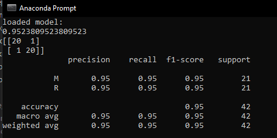
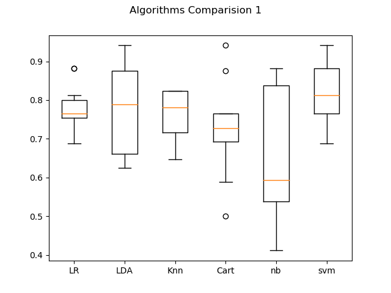
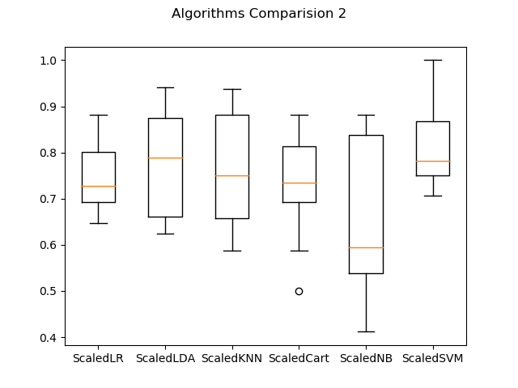
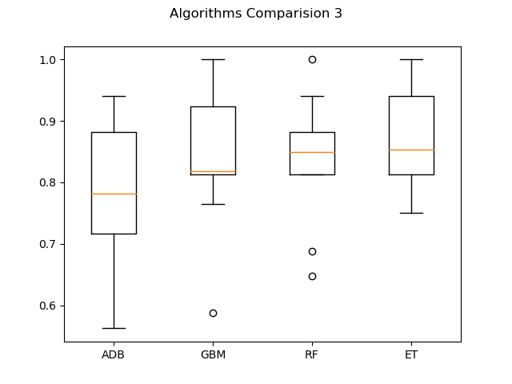

# Sonar Mines vs Rocks Dataset Classification

This repository hosts the code, tests, documentation and pipelined model for the analysis undertaken of the Sonar Mines vs Rocks dataset.

## Model

After the completion of the project we have trained a KNN model with number of neighbours set to 3, and we have trained it on on scaled data. Model is saved as [model.sav](model.sav). The accuracy score of the model is 95%.

## About the Dataset: Sonar Mines vs Rocks

The repository is hosted at [UCI Machine Learning Repository](https://archive.ics.uci.edu/ml/datasets/Connectionist+Bench+(Sonar,+Mines+vs.+Rocks))The task is to train a network to discriminate between sonar signals bounced off a metal cylinder and those bounced off a roughly cylindrical rock.

The data set is multivariate and contains ratio(numerical) and one nominal class data.
There are 208 instances and 60 attributes.

## Project Steps

1. [x] Data Download
2. [x] Data Loading
3. [x] Data Analysis
   1. [x] Descriptive Statistics
   2. [x] Data Visualization
      1. [x] Unimodal Data Visualizations
      2. [x] Multimodal Data Visualizations
4. [x] Partitioning of dataset into Training dataset and Validation dataset
5. [x] Model Creation
6. [x] Model Selection
   - [x] Create test harness using K-Fold Cross Validation, with scoring set to 'accuracy'
   - [x] Summarization, Visualization and Comparison of Results
   - [x] Standardization of Dataset
   - [x] Re-evaluation of models using test harness
   - [x] Summarization, Visualization and Comparison of Results
   - [x] Model Selection
   - [x] Model tuning
   - [x] Model tuning
   - [x] Summarization, Visualization and Comparison of Results
   - [x] Creation of Ensembles
   - [x] Evaluation of models using test harness
   - [x] Summarization, Visualization and Comparison of Results
   - [x] Tuning of Ensemble models
7. [x] Model Finalization
   1. [x] Model Preparation
   2. [x] Validation Set transformation
   3. [x] Summarization, Visualization and Comparison of Results
   4. [x] Training the model on entire dataset
   5. [x] Summarization of Results
   6. [x] Saving the Pipelined Project
   7. [x] Testing the saved model

## Project Files

1. Dataset
2. Python file (using template.py as the base)
3. Model files
4. Image files
5. Documentation
   1. README.md
   2. Project Report

## Images

### Output

*Output*

### Visualizations

#### Histogram

*Histogram*

#### Density Plot

*Density Plot*

#### Correlation Matrix

*Correlation Matrix*

### Comparisions

#### Algorithm Comparision 1

*Algorithm Comparision 1*

#### Algorithm Comparision 2

*Algorithm Comparision 2*

#### Algorithm Comparision 3

*Algorithm Comparision 3*

## Project Output

    Shape of dataset:
    (208, 61)
    Dtypes:
    0     float64
    1     float64
    2     float64
    3     float64
    4     float64
    5     float64
    6     float64
    7     float64
    8     float64
    9     float64
    10    float64
    11    float64
    12    float64
    13    float64
    14    float64
    15    float64
    16    float64
    17    float64
    18    float64
    19    float64
    20    float64
    21    float64
    22    float64
    23    float64
    24    float64
    25    float64
    26    float64
    27    float64
    28    float64
    29    float64
    30    float64
    31    float64
    32    float64
    33    float64
    34    float64
    35    float64
    36    float64
    37    float64
    38    float64
    39    float64
    40    float64
    41    float64
    42    float64
    43    float64
    44    float64
    45    float64
    46    float64
    47    float64
    48    float64
    49    float64
    50    float64
    51    float64
    52    float64
    53    float64
    54    float64
    55    float64
    56    float64
    57    float64
    58    float64
    59    float64
    60     object
    dtype: object
    Data(20 rows):
            0         1         2         3     4     5   ...        55        56        57        58        59  60
    0   2.00e-02  3.71e-02  4.28e-02  2.07e-02  0.10  0.10  ...  1.67e-02  1.80e-02  8.40e-03  9.00e-03  3.20e-03   R
    1   4.53e-02  5.23e-02  8.43e-02  6.89e-02  0.12  0.26  ...  1.91e-02  1.40e-02  4.90e-03  5.20e-03  4.40e-03   R
    2   2.62e-02  5.82e-02  1.10e-01  1.08e-01  0.10  0.23  ...  2.44e-02  3.16e-02  1.64e-02  9.50e-03  7.80e-03   R
    3   1.00e-02  1.71e-02  6.23e-02  2.05e-02  0.02  0.04  ...  7.30e-03  5.00e-03  4.40e-03  4.00e-03  1.17e-02   R
    4   7.62e-02  6.66e-02  4.81e-02  3.94e-02  0.06  0.06  ...  1.50e-03  7.20e-03  4.80e-03  1.07e-02  9.40e-03   R
    5   2.86e-02  4.53e-02  2.77e-02  1.74e-02  0.04  0.10  ...  8.90e-03  5.70e-03  2.70e-03  5.10e-03  6.20e-03   R
    6   3.17e-02  9.56e-02  1.32e-01  1.41e-01  0.17  0.17  ...  1.38e-02  9.20e-03  1.43e-02  3.60e-03  1.03e-02   R
    7   5.19e-02  5.48e-02  8.42e-02  3.19e-02  0.12  0.09  ...  9.70e-03  8.50e-03  4.70e-03  4.80e-03  5.30e-03   R
    8   2.23e-02  3.75e-02  4.84e-02  4.75e-02  0.06  0.06  ...  4.90e-03  6.50e-03  9.30e-03  5.90e-03  2.20e-03   R
    9   1.64e-02  1.73e-02  3.47e-02  7.00e-03  0.02  0.07  ...  6.80e-03  3.20e-03  3.50e-03  5.60e-03  4.00e-03   R
    10  3.90e-03  6.30e-03  1.52e-02  3.36e-02  0.03  0.03  ...  9.30e-03  4.20e-03  3.00e-04  5.30e-03  3.60e-03   R
    11  1.23e-02  3.09e-02  1.69e-02  3.13e-02  0.04  0.01  ...  1.18e-02  2.60e-03  9.20e-03  9.00e-04  4.40e-03   R
    12  7.90e-03  8.60e-03  5.50e-03  2.50e-02  0.03  0.05  ...  1.90e-03  5.90e-03  5.80e-03  5.90e-03  3.20e-03   R
    13  9.00e-03  6.20e-03  2.53e-02  4.89e-02  0.12  0.16  ...  1.52e-02  1.58e-02  5.30e-03  1.89e-02  1.02e-02   R
    14  1.24e-02  4.33e-02  6.04e-02  4.49e-02  0.06  0.04  ...  5.40e-03  1.14e-02  1.96e-02  1.47e-02  6.20e-03   R
    15  2.98e-02  6.15e-02  6.50e-02  9.21e-02  0.16  0.23  ...  7.60e-03  1.52e-02  4.90e-03  2.00e-02  7.30e-03   R
    16  3.52e-02  1.16e-02  1.91e-02  4.69e-02  0.07  0.12  ...  4.80e-03  9.50e-03  1.50e-03  7.30e-03  6.70e-03   R
    17  1.92e-02  6.07e-02  3.78e-02  7.74e-02  0.14  0.08  ...  2.40e-03  4.50e-03  3.70e-03  1.12e-02  7.50e-03   R
    18  2.70e-02  9.20e-03  1.45e-02  2.78e-02  0.04  0.08  ...  3.90e-03  1.20e-02  1.32e-02  7.00e-03  8.80e-03   R
    19  1.26e-02  1.49e-02  6.41e-02  1.73e-01  0.26  0.26  ...  6.00e-04  1.81e-02  9.40e-03  1.16e-02  6.30e-03   R

    [20 rows x 61 columns]
    Data description:
                0         1         2         3         4   ...        55        56        57        58        59
    count  2.08e+02  2.08e+02  2.08e+02  2.08e+02  2.08e+02  ...  2.08e+02  2.08e+02  2.08e+02  2.08e+02  2.08e+02
    mean   2.92e-02  3.84e-02  4.38e-02  5.39e-02  7.52e-02  ...  8.22e-03  7.82e-03  7.95e-03  7.94e-03  6.51e-03
    std    2.30e-02  3.30e-02  3.84e-02  4.65e-02  5.56e-02  ...  5.74e-03  5.79e-03  6.47e-03  6.18e-03  5.03e-03
    min    1.50e-03  6.00e-04  1.50e-03  5.80e-03  6.70e-03  ...  4.00e-04  3.00e-04  3.00e-04  1.00e-04  6.00e-04
    25%    1.34e-02  1.64e-02  1.89e-02  2.44e-02  3.81e-02  ...  4.40e-03  3.70e-03  3.60e-03  3.68e-03  3.10e-03
    50%    2.28e-02  3.08e-02  3.43e-02  4.40e-02  6.25e-02  ...  6.85e-03  5.95e-03  5.80e-03  6.40e-03  5.30e-03
    75%    3.55e-02  4.79e-02  5.80e-02  6.45e-02  1.00e-01  ...  1.06e-02  1.04e-02  1.03e-02  1.03e-02  8.53e-03
    max    1.37e-01  2.34e-01  3.06e-01  4.26e-01  4.01e-01  ...  3.94e-02  3.55e-02  4.40e-02  3.64e-02  4.39e-02

    [8 rows x 60 columns]
    Class disributions:
    60
    M    111
    R     97
    dtype: int64
    LR : 0.7823529411764706 (0.05765849976504512)
    LDA : 0.7775735294117647 (0.10981821346502826)
    Knn : 0.7647058823529411 (0.06310263101901922)
    Cart : 0.7338235294117647 (0.12438429678700293)
    nb : 0.6544117647058824 (0.1657187214429263)
    svm : 0.8191176470588235 (0.085477743516533)
    ScaledLR : 0.7415441176470589 (0.07336470523384143)
    ScaledLDA : 0.7775735294117647 (0.10981821346502826)
    ScaledKNN : 0.7654411764705882 (0.11687244991944426)
    ScaledCart : 0.7588235294117647 (0.12512104865532814)
    ScaledNB : 0.6544117647058824 (0.1657187214429263)
    ScaledSVM : 0.8121323529411765 (0.09548141656000132)
    Best: 0.8672794117647058 using {'n_neighbors': 3}
    0.8430147058823529 (0.06846630678194832) with {'n_neighbors': 1}
    0.8672794117647058 (0.05899446670727795) with {'n_neighbors': 3}
    0.7830882352941175 (0.10440140793705203) with {'n_neighbors': 5}
    0.7764705882352941 (0.11262008201014735) with {'n_neighbors': 7}
    0.7213235294117647 (0.10155048005794948) with {'n_neighbors': 9}
    0.7084558823529411 (0.13465170773589827) with {'n_neighbors': 11}
    0.7084558823529411 (0.1256476517734962) with {'n_neighbors': 13}
    0.7025735294117647 (0.11854494223900836) with {'n_neighbors': 15}
    0.6915441176470588 (0.12475592520478705) with {'n_neighbors': 17}
    0.7220588235294118 (0.12260023439638458) with {'n_neighbors': 19}
    0.7283088235294117 (0.11531992977114641) with {'n_neighbors': 21}
    0.7220588235294118 (0.13507414982726004) with {'n_neighbors': 23}
    0.7158088235294118 (0.11834638200307601) with {'n_neighbors': 25}
    0.7158088235294118 (0.118346382003076) with {'n_neighbors': 27}
    0.7095588235294118 (0.12129010234695838) with {'n_neighbors': 29}
    Best: 0.8485294117647058 using {'C': 1.9, 'kernel': 'rbf'}
    0.7595588235294117 (0.07413719396774984) with {'C': 0.1, 'kernel': 'linear'}
    0.55 (0.12802566513889335) with {'C': 0.1, 'kernel': 'poly'}
    0.5610294117647059 (0.17806570751767906) with {'C': 0.1, 'kernel': 'rbf'}
    0.6981617647058823 (0.10975911912048038) with {'C': 0.1, 'kernel': 'sigmoid'}
    0.7709558823529411 (0.04454602077770838) with {'C': 0.3, 'kernel': 'linear'}
    0.6150735294117646 (0.1449765261097029) with {'C': 0.3, 'kernel': 'poly'}
    0.7588235294117647 (0.09476740329165717) with {'C': 0.3, 'kernel': 'rbf'}
    0.7647058823529412 (0.10568813887547616) with {'C': 0.3, 'kernel': 'sigmoid'}
    0.7591911764705882 (0.06448512643347974) with {'C': 0.5, 'kernel': 'linear'}
    0.6878676470588235 (0.12353652377986218) with {'C': 0.5, 'kernel': 'poly'}
    0.7823529411764707 (0.09773881673919453) with {'C': 0.5, 'kernel': 'rbf'}
    0.7227941176470589 (0.10151586798765598) with {'C': 0.5, 'kernel': 'sigmoid'}
    0.7591911764705882 (0.05887520707947036) with {'C': 0.7, 'kernel': 'linear'}
    0.7 (0.1274224609871189) with {'C': 0.7, 'kernel': 'poly'}
    0.8003676470588236 (0.08954376020331892) with {'C': 0.7, 'kernel': 'rbf'}
    0.7408088235294118 (0.08977290769907925) with {'C': 0.7, 'kernel': 'sigmoid'}
    0.7588235294117647 (0.07060738098198334) with {'C': 0.9, 'kernel': 'linear'}
    0.7238970588235294 (0.12930989055025002) with {'C': 0.9, 'kernel': 'poly'}
    0.8 (0.10172867859381102) with {'C': 0.9, 'kernel': 'rbf'}
    0.7294117647058823 (0.0924133373139116) with {'C': 0.9, 'kernel': 'sigmoid'}
    0.7588235294117647 (0.07060738098198334) with {'C': 1, 'kernel': 'linear'}
    0.7297794117647058 (0.1185426618269152) with {'C': 1, 'kernel': 'poly'}
    0.8121323529411765 (0.09948844610458289) with {'C': 1, 'kernel': 'rbf'}
    0.7231617647058823 (0.09292165771400301) with {'C': 1, 'kernel': 'sigmoid'}
    0.7408088235294118 (0.08004665189274783) with {'C': 1.3, 'kernel': 'linear'}
    0.7415441176470587 (0.10660560276797129) with {'C': 1.3, 'kernel': 'poly'}
    0.8246323529411764 (0.09048973469280967) with {'C': 1.3, 'kernel': 'rbf'}
    0.7055147058823529 (0.10853312304351079) with {'C': 1.3, 'kernel': 'sigmoid'}
    0.7345588235294118 (0.08617069846157914) with {'C': 1.5, 'kernel': 'linear'}
    0.7533088235294118 (0.09488499800295491) with {'C': 1.5, 'kernel': 'poly'}
    0.8430147058823529 (0.08059859985947619) with {'C': 1.5, 'kernel': 'rbf'}
    0.7294117647058824 (0.12115853308128281) with {'C': 1.5, 'kernel': 'sigmoid'}
    0.7404411764705883 (0.0899526499818339) with {'C': 1.7, 'kernel': 'linear'}
    0.7591911764705882 (0.08980301515618429) with {'C': 1.7, 'kernel': 'poly'}
    0.8367647058823529 (0.0850242943095523) with {'C': 1.7, 'kernel': 'rbf'}
    0.7536764705882353 (0.11558393196599483) with {'C': 1.7, 'kernel': 'sigmoid'}
    0.7341911764705882 (0.09541910943116517) with {'C': 1.9, 'kernel': 'linear'}
    0.7772058823529411 (0.08529411764705881) with {'C': 1.9, 'kernel': 'poly'}
    0.8485294117647058 (0.08233652672549403) with {'C': 1.9, 'kernel': 'rbf'}
    0.7411764705882353 (0.1186446673619409) with {'C': 1.9, 'kernel': 'sigmoid'}
    0.7283088235294117 (0.10551470588235293) with {'C': 2, 'kernel': 'linear'}
    0.7834558823529412 (0.0853614402161687) with {'C': 2, 'kernel': 'poly'}
    0.8485294117647058 (0.08233652672549403) with {'C': 2, 'kernel': 'rbf'}
    0.7474264705882353 (0.11391186817479845) with {'C': 2, 'kernel': 'sigmoid'}
    ADB:  0.7816176470588235 (0.11432818662104005)
    GBM:  0.8433823529411765 (0.10640445215989021)
    RF:  0.8363970588235293 (0.09431060757248912)
    ET:  0.8661764705882353 (0.08656819720986507)
    0.8809523809523809
    [[19  2]
    [ 3 18]]
                precision    recall  f1-score   support

            M       0.86      0.90      0.88        21
            R       0.90      0.86      0.88        21

        accuracy                           0.88        42
    macro avg       0.88      0.88      0.88        42
    weighted avg       0.88      0.88      0.88        42

    0.9523809523809523
    [[20  1]
    [ 1 20]]
                precision    recall  f1-score   support

            M       0.95      0.95      0.95        21
            R       0.95      0.95      0.95        21

        accuracy                           0.95        42
    macro avg       0.95      0.95      0.95        42
    weighted avg       0.95      0.95      0.95        42

    loaded model:
    0.9523809523809523
    [[20  1]
    [ 1 20]]
                precision    recall  f1-score   support

            M       0.95      0.95      0.95        21
            R       0.95      0.95      0.95        21

        accuracy                           0.95        42
    macro avg       0.95      0.95      0.95        42
    weighted avg       0.95      0.95      0.95        42

## Project Status

Project has been completed successfully.
